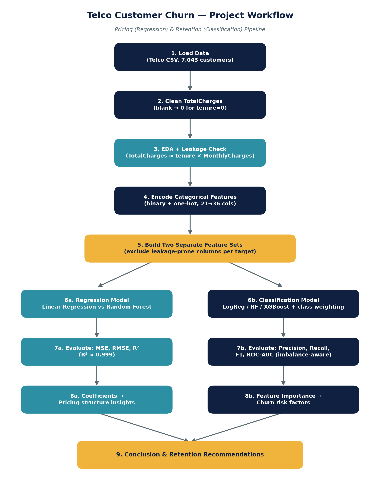

# 📊 Telco Customer Churn – Pricing & Retention Analysis

## 📌 Project Overview
This project analyzes the **IBM Telco Customer Churn** dataset and develops two Machine Learning models to solve two business problems:
1. **Regression:** Predict a customer's **MonthlyCharges**.
2. **Classification:** Predict whether a customer will **Churn (Yes/No)**.

The project follows a complete Machine Learning workflow including data cleaning, exploratory data analysis (EDA), feature engineering, model building, evaluation, and business insights.

---

## 🎯 Project Objectives

### Regression Model
Predict a customer's **MonthlyCharges** using demographic and service-related features.

**Evaluation Metrics**
- Mean Squared Error (MSE)
- Root Mean Squared Error (RMSE)
- R² Score

### Classification Model
Predict whether a customer is likely to **Churn**.

**Evaluation Metrics**
- Accuracy
- Precision
- Recall
- F1-Score
- ROC-AUC

---

## 📂 Dataset
- **Dataset:** IBM Telco Customer Churn
- **Records:** 7,043 Customers
- **Features:** 21 Columns

### Target Variables
- **Regression:** `MonthlyCharges`
- **Classification:** `Churn`

---

## 🛠️ Technologies Used
- Python
- Pandas
- NumPy
- Matplotlib
- Seaborn
- Scikit-learn
- XGBoost
- Jupyter Notebook

---

## 🔄 Project Workflow
- Data Loading
- Data Cleaning (fixing `TotalCharges`, handling blank values)
- Exploratory Data Analysis (EDA) + Leakage Verification
- Data Encoding (binary + one-hot)
- Building Separate Feature Sets (avoiding leakage between the two models)
- Regression Modeling
- Classification Modeling (with class-imbalance handling)
- Model Evaluation
- Feature Importance Analysis
- Business Insights & Recommendations



---

## ⚠️ Data Leakage Handling
`TotalCharges` correlates at **0.9996** with `tenure × MonthlyCharges` — functionally
a near-duplicate of the regression target combined with tenure. It was **excluded**
from the regression model's features to avoid the model "cheating" via arithmetic,
while still being used as a legitimate input for the classification model, where
accumulated billing history is a genuine (non-circular) churn signal.

---

## 🤖 Machine Learning Models

### Regression Models
- Linear Regression
- Random Forest Regressor

### Classification Models
- Logistic Regression
- Random Forest Classifier
- XGBoost Classifier

---

## 📈 Regression Results

| Model | MSE | RMSE | R² |
|---|---:|---:|---:|
| **Linear Regression** | 1.11 | 1.05 | **99.88%** |
| Random Forest | 1.53 | 1.24 | 99.83% |

**Best Regression Model:** Linear Regression — near-identical performance to
Random Forest, but far more interpretable. Its coefficients directly show each
service's dollar contribution to price (e.g. Fiber optic internet ≈ +$25/month,
each streaming service ≈ +$10/month), making it well-suited for detecting
pricing/billing anomalies.

---

## 📈 Classification Results

| Model | Accuracy | Precision | Recall | F1-Score | ROC-AUC |
|------|---------:|----------:|--------:|---------:|---------:|
| Logistic Regression | 74.02% | 50.69% | **78.61%** | 61.64% | 84.14% |
| **Random Forest** | **76.93%** | **54.97%** | 72.46% | **62.51%** | **84.18%** |
| XGBoost | 76.22% | 53.88% | 72.46% | 61.80% | 83.39% |

**Best Classification Model:** Random Forest Classifier — best overall balance
of Accuracy, F1, and ROC-AUC. Logistic Regression remains a reasonable
alternative where catching more churners (higher Recall) matters more than
reducing false alarms.

---

## 📊 Key Business Insights

**Pricing:**
- `MonthlyCharges` is almost entirely explained by which services a customer
  subscribes to — internet type and add-ons combine in a near-additive,
  predictable way — enabling automated detection of billing anomalies.

**Churn:**
- Customers with **Month-to-Month contracts** churn at ~43%, vs. ~3% for
  Two-year contracts.
- Customers with **longer tenure** are far less likely to leave (~47% churn
  in year one, dropping below 10% after 4+ years).
- **Fiber Optic Internet** customers show higher churn rates than DSL.
- Customers with internet service but **no security/support add-ons** churn
  at roughly 40%, vs. 15–22% for those with add-ons.

---

## 💼 Business Recommendations
- Encourage customers to switch to long-term contracts through incentives.
- Offer personalized retention campaigns for high-risk customers (new,
  month-to-month, Fiber optic customers).
- Use the pricing model to flag customers whose actual charges deviate from
  their predicted price — candidates for billing review or negotiation.
- Promote value-added services such as Tech Support and Online Security,
  which correlate with lower churn.

---

## ▶️ How to Run
1. Clone this repository.
2. Install dependencies: `pip install -r requirements.txt`
3. Open `Telco_Customer_Churn_Pricing_Retention_Analysis.ipynb` in Jupyter or
   Google Colab.
4. Run all cells — the dataset loads directly from a public URL, no manual
   download needed.
5. Trained models are also available pre-saved in the `models/` folder if you
   just want to load and use them directly:
   ```python
   import joblib
   churn_model = joblib.load('models/random_forest_churn.pkl')
   pricing_model = joblib.load('models/linear_regression_monthlycharges.pkl')
   ```

---

## 📁 Repository Structure
```text
Telco-Customer-Churn-Pricing-Retention-Analysis/
│
├── Telco_Customer_Churn_Pricing_Retention_Analysis.ipynb
├── README.md
├── requirements.txt
├── LICENSE
├── .gitignore
│
├── dataset/
│   └── Telco-Customer-Churn.csv
│
├── models/
│   ├── random_forest_churn.pkl
│   └── linear_regression_monthlycharges.pkl
│
└── images/
    ├── telco_banner.png
    ├── project_workflow.png
    ├── correlation_heatmap.png
    ├── actual_vs_predicted_regression.png
    ├── confusion_matrix.png
    ├── feature_importance_classification.png
    └── roc_curve.png
```

---

## 👨‍💻 Author
**Sudheer Ahmed**
Computer Science Student
Machine Learning Project